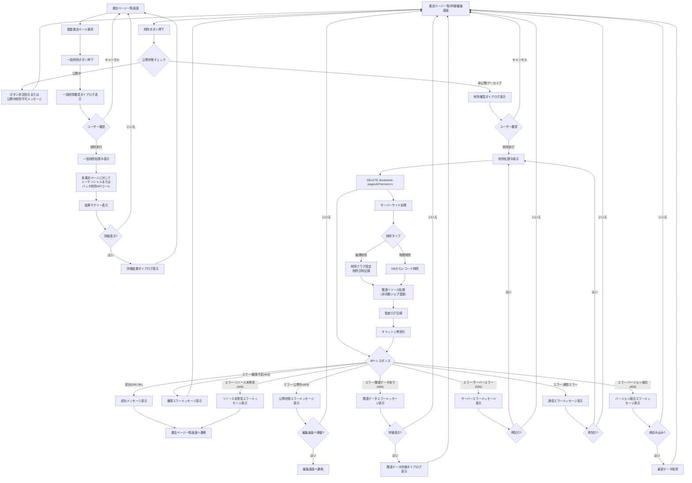

```mermaid
graph TD
    A[書店ページ一覧/詳細/編集画面] --> B[削除ボタン押下]
    
    B --> C{公開状態チェック}
    C -- 公開中 --> D[ボタン非活性化または<br>公開中削除不可メッセージ]
    D --> A
    
    C -- 非公開/アーカイブ --> E[削除確認ダイアログ表示]
    E --> F{ユーザー確認}
    
    F -- キャンセル --> A
    
    F -- 削除実行 --> G[削除処理中表示]
    G --> H[DELETE /bookstore-pages/id?version=v]
    
    H --> I{API レスポンス}
    
    I -- 成功(200 OK) --> J[成功メッセージ表示]
    J --> K[書店ページ一覧画面へ遷移]
    
    I -- エラー:権限不足(403) --> L[権限エラーメッセージ表示]
    L --> A
    
    I -- エラー:公開中(403) --> M[公開状態エラーメッセージ表示]
    M --> N{編集画面へ移動?}
    N -- はい --> O[編集画面へ遷移]
    N -- いいえ --> A
    
    I -- エラー:関連データあり(409) --> P[関連データエラーメッセージ表示]
    P --> Q{詳細表示?}
    Q -- はい --> R[関連データ詳細ダイアログ表示]
    R --> A
    Q -- いいえ --> A
    
    I -- エラー:バージョン競合(409) --> S[バージョン競合エラーメッセージ表示]
    S --> T{再読み込み?}
    T -- はい --> U[最新データ取得]
    U --> A
    T -- いいえ --> A
    
    I -- エラー:リソース未発見(404) --> V[リソース未発見エラーメッセージ表示]
    V --> K
    
    I -- エラー:サーバーエラー(500) --> W[サーバーエラーメッセージ表示]
    W --> X{再試行?}
    X -- はい --> G
    X -- いいえ --> A
    
    I -- エラー:通信エラー --> Y[通信エラーメッセージ表示]
    Y --> Z{再試行?}
    Z -- はい --> G
    Z -- いいえ --> A
    
    %% 一括削除サブフロー
    AA[書店ページ一覧画面] --> AB[複数書店ページ選択]
    AB --> AC[一括削除ボタン押下]
    AC --> AD[一括削除確認ダイアログ表示]
    AD --> AE{ユーザー確認}
    AE -- キャンセル --> AA
    AE -- 削除実行 --> AF[一括削除処理中表示]
    
    AF --> AG[各書店ページに対して<br>シーケンシャルまたは<br>バッチ削除APIコール]
    AG --> AH[結果サマリー表示]
    AH --> AI{詳細表示?}
    AI -- はい --> AJ[詳細結果ダイアログ表示]
    AJ --> AA
    AI -- いいえ --> AA
    
    %% 論理削除と物理削除のサーバーサイドフロー（参考情報）
    H --> BA[サーバーサイド処理]
    BA --> BB{削除タイプ}
    BB -- 論理削除 --> BC[削除フラグ設定<br>削除日時記録]
    BB -- 物理削除 --> BD[DBからレコード削除]
    BC --> BE[関連リソース処理<br>（非同期ジョブ登録）]
    BD --> BE
    BE --> BF[監査ログ記録]
    BF --> BG[キャッシュ無効化]
    BG --> I
```