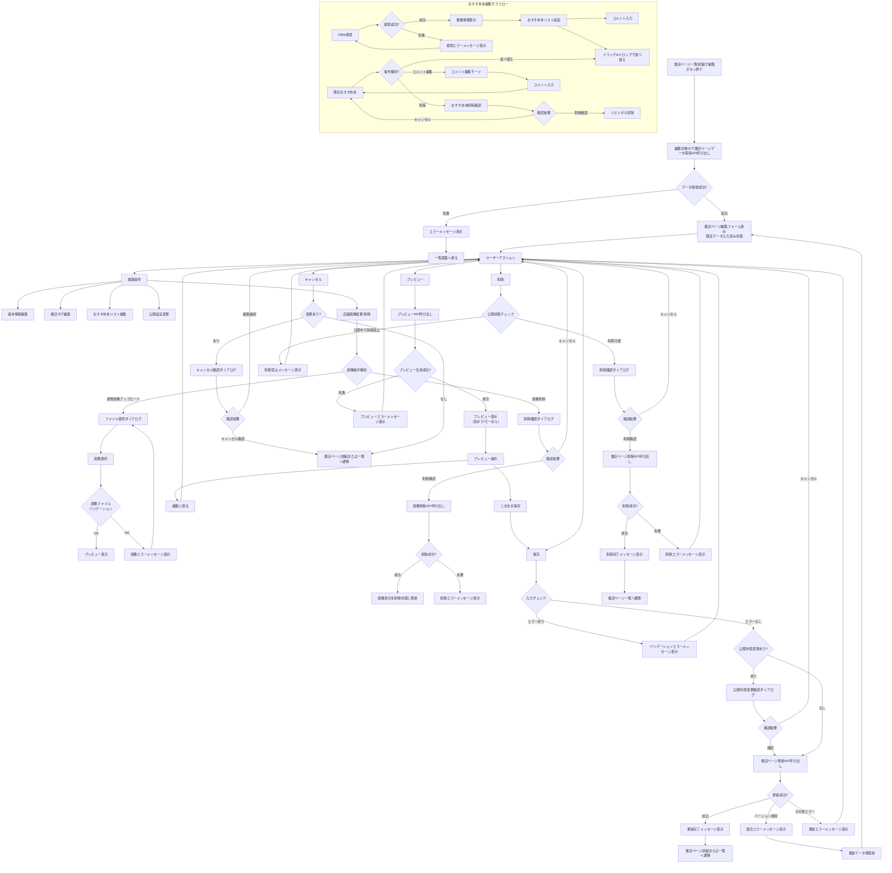

```mermaid
graph TD
    A[書店ページ一覧/詳細で編集ボタン押下] --> B[編集対象IDで書店ページデータ取得API呼び出し]
    B --> C{データ取得成功?}
    C -- 成功 --> D[書店ページ編集フォーム表示<br>既存データ入力済み状態]
    C -- 失敗 --> E[エラーメッセージ表示]
    E --> F[一覧画面へ戻る]
    
    D --> G[ユーザーアクション]
    
    G --> H[編集操作]
    H --> H1[基本情報編集]
    H --> H2[書店タグ編集]
    H --> H3[おすすめ本リスト編集]
    H --> H4[公開設定変更]
    H --> H5[店舗画像変更/削除]
    
    H5 --> I{画像操作種別}
    I -- 新規画像アップロード --> J[ファイル選択ダイアログ]
    J --> K[画像選択]
    K --> L{画像ファイル<br>バリデーション}
    L -- OK --> M[プレビュー表示]
    L -- NG --> N[画像エラーメッセージ表示]
    N --> J
    
    I -- 画像削除 --> O[削除確認ダイアログ]
    O --> P{確認結果}
    P -- キャンセル --> G
    P -- 削除確認 --> Q[画像削除API呼び出し]
    Q --> R{削除成功?}
    R -- 成功 --> S[画像表示を削除状態に更新]
    R -- 失敗 --> T[削除エラーメッセージ表示]
    
    G --> U[プレビュー]
    U --> V[プレビューAPI呼び出し]
    V --> W{プレビュー生成成功?}
    W -- 成功 --> X[プレビュー表示<br>（別タブ/モーダル）]
    X --> Y[プレビュー操作]
    Y --> Y1[編集に戻る]
    Y1 --> G
    Y --> Y2[このまま保存]
    Y2 --> AA
    W -- 失敗 --> Z[プレビューエラーメッセージ表示]
    Z --> G
    
    G --> AA[保存]
    AA --> AB{入力チェック}
    AB -- エラーあり --> AC[バリデーションエラーメッセージ表示]
    AC --> G
    AB -- エラーなし --> AD{公開状態変更あり?}
    AD -- あり --> AE[公開状態変更確認ダイアログ]
    AE --> AF{確認結果}
    AF -- キャンセル --> G
    AF -- 確認 --> AG[書店ページ更新API呼び出し]
    AD -- なし --> AG
    
    AG --> AH{更新成功?}
    AH -- 成功 --> AI[更新完了メッセージ表示]
    AI --> AJ[書店ページ詳細または一覧へ遷移]
    AH -- バージョン衝突 --> AK[競合エラーメッセージ表示]
    AK --> AL[最新データ再取得]
    AL --> D
    AH -- その他エラー --> AM[更新エラーメッセージ表示]
    AM --> G
    
    G --> AN[キャンセル]
    AN --> AO{変更あり?}
    AO -- あり --> AP[キャンセル確認ダイアログ]
    AP --> AQ{確認結果}
    AQ -- 編集継続 --> G
    AQ -- キャンセル確認 --> AR[書店ページ詳細または一覧へ遷移]
    AO -- なし --> AR
    
    G --> AS[削除]
    AS --> AT{公開状態チェック}
    AT -- 公開中で削除禁止 --> AU[削除禁止メッセージ表示]
    AU --> G
    AT -- 削除可能 --> AV[削除確認ダイアログ]
    AV --> AW{確認結果}
    AW -- キャンセル --> G
    AW -- 削除確認 --> AX[書店ページ削除API呼び出し]
    AX --> AY{削除成功?}
    AY -- 成功 --> AZ[削除完了メッセージ表示]
    AZ --> BA[書店ページ一覧へ遷移]
    AY -- 失敗 --> BB[削除エラーメッセージ表示]
    BB --> G
    
    subgraph "おすすめ本編集サブフロー"
        H31[ISBN検索] --> H32{検索成功?}
        H32 -- 成功 --> H33[書籍情報表示]
        H33 --> H34[おすすめ本リスト追加]
        H34 --> H35[コメント入力]
        H34 --> H36[ドラッグ&ドロップで並べ替え]
        H32 -- 失敗 --> H37[検索エラーメッセージ表示]
        H37 --> H31
        
        H38[既存おすすめ本] --> H39{操作種別?}
        H39 -- 削除 --> H40[おすすめ本削除確認]
        H40 --> H41{確認結果}
        H41 -- 削除確認 --> H42[リストから削除]
        H41 -- キャンセル --> H38
        H39 -- コメント編集 --> H43[コメント編集モード]
        H43 --> H44[コメント入力]
        H44 --> H38
        H39 -- 並べ替え --> H36
    end
```