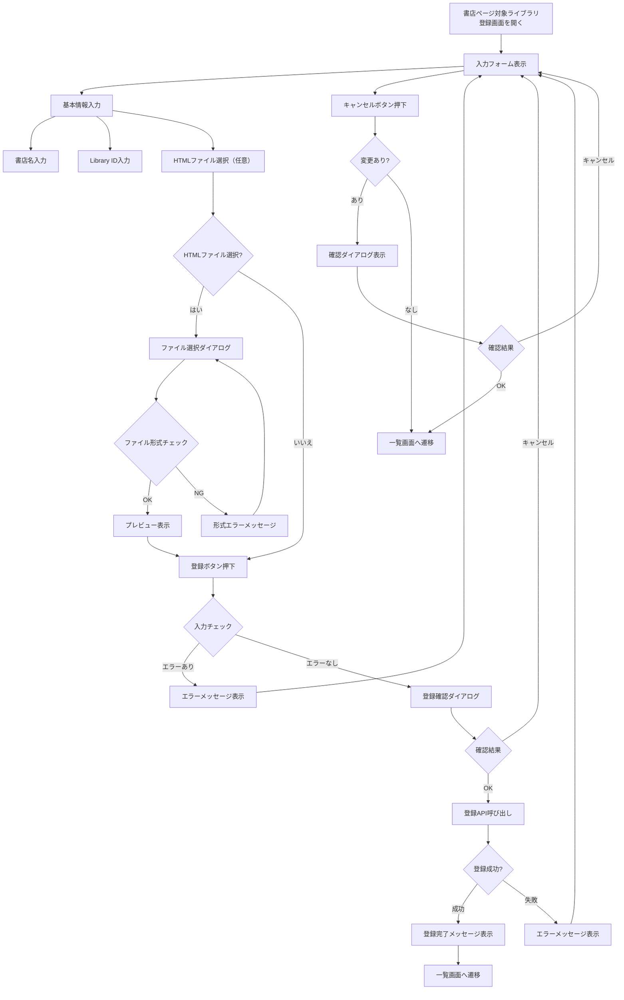

```mermaid
graph TD
    A[書店ページ対象ライブラリ登録画面を開く] --> B[入力フォーム表示]
    
    B --> C[基本情報入力]
    C --> C1[書店名入力]
    C --> C2[Library ID入力]
    C --> C3[HTMLファイル選択（任意）]
    
    C3 --> D{HTMLファイル選択?}
    D -- はい --> D1[ファイル選択ダイアログ]
    D1 --> D2{ファイル形式チェック}
    D2 -- OK --> D3[プレビュー表示]
    D2 -- NG --> D4[形式エラーメッセージ]
    D4 --> D1
    D3 --> E[登録ボタン押下]
    D -- いいえ --> E
    
    E --> F{入力チェック}
    F -- エラーあり --> F1[エラーメッセージ表示]
    F1 --> B
    F -- エラーなし --> G[登録確認ダイアログ]
    
    G --> H{確認結果}
    H -- キャンセル --> B
    H -- OK --> I[登録API呼び出し]
    
    I --> J{登録成功?}
    J -- 成功 --> K[登録完了メッセージ表示]
    K --> L[一覧画面へ遷移]
    J -- 失敗 --> M[エラーメッセージ表示]
    M --> B
    
    B --> N[キャンセルボタン押下]
    N --> O{変更あり?}
    O -- あり --> P[確認ダイアログ表示]
    P --> Q{確認結果}
    Q -- キャンセル --> B
    Q -- OK --> R[一覧画面へ遷移]
    O -- なし --> R
```
